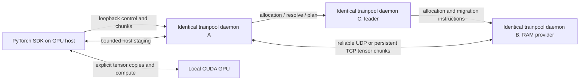

# Architecture

TrainPool's useful capacity is the sum of separately managed RAM allocations and
usable GPU memory. An individual CUDA operation still needs its operands and workspace
on its assigned GPU. Remote RAM is backing storage with explicit transfers, not a
CUDA pointer or a distributed allocator intercepted underneath arbitrary PyTorch code.

The leader may be A, B or C. When the leader is also an endpoint or the SDK's local
daemon, it naturally handles that endpoint's payloads. It is never inserted as an
intermediate hop solely because it is leader.

## Runtime boundaries

* `cluster`: pluggable async discovery, multicast packets, membership timeout and election.
* `node`: sysinfo CPU/RAM monitoring and optional, time-bounded nvidia-smi probing.
* `transport` / `protocol`: versioned framed-TCP control, persistent TCP reference
  payload transport, and MTU-safe reliable selective-repeat UDP payload transport.
* `memory`: lease-bearing block handles, atomic RAM reservations, local immutable
  committed storage, residency metadata and source-driven migration.
* `scheduler`: directed link estimates, replaceable placement/planning interfaces and
  capacity-aware stage assignments.
* `runtime`: dispatch, membership exchange, pressure handling and services sharing one
  process. No remote execution endpoint exists.
* `python/trainpool_torch`: local SDK, tier-aware tensor table, saved-tensor hooks,
  graph and sequential recomputation, next-use eviction and bounded prefetch.

The one executable includes daemon and CLI commands. `run` launches a structured
local program/argument vector with inherited working directory/environment using
`Command`, without a shell, and passes the local daemon configuration and job ID.

## Membership and leadership

The installation UUID is persistent metadata. Each daemon start has a new incarnation,
which prevents a restarted node being mistaken for the surviving owner of RAM bytes.
Announcements arrive approximately every two seconds. Only a successful TCP capability
exchange updates membership liveness; a replayed multicast packet cannot preserve a
dead peer. Expiry uses local monotonic `Instant` values and a seven-second threshold.
The two-second monitor granularity means observed failover is normally seven to nine
seconds plus scheduling delay, not a real-time deadline.

Every peer elects the maximum `(physical_ram + sum(physical_vram), node_uuid)` tuple.
The larger UUID wins ties. CPU-only leaders are ordinary supported peers. Free memory,
budget changes and GPU utilization never enter the score. GPU physical inventory is
fixed for a daemon lifetime; refreshes update observations without changing that score.

`leader_epoch` is a UUID generation token advertised by the current leader. It changes
when that process becomes leader again and on process restart. Followers derive the
same leader and generation once membership exchange converges. Schedule and migration
requests include the generation. Active jobs are invalidated by a leader-generation
change, rather than silently resuming from incomplete job metadata.

This is not consensus. Partitioned views can temporarily elect different leaders.
Epoch checks prevent using known stale leaders but are not quorum fencing. Use one
trusted, connected LAN for experiments. Replicated metadata, durable job recovery,
quorum fencing and partition-tolerant scheduling are future work.

## Discovery and topology

Multicast is bound with address/port reuse so several installations can be simulated on
one host. Interface and advertised address are explicit configurable options. The
default address selection uses a UDP route lookup without sending application data.
Seeds use the same authenticated capability exchange and can replace multicast on VPNs.
Direct peers remain monitored after discovery. Seed-only deployments need a sufficiently
complete set of seeds; general transitive membership gossip is not implemented.

Normal exchanges provide an exponentially weighted control RTT estimate. Explicit
`benchmark` transfers at most 64 MiB per directed pair with bounded 8 KiB scratch,
sequentially, and stores an EWMA of effective bandwidth. Unmeasured links are visibly
unmeasured and use a conservative 10 MB/s, 10 ms planning prior. There is no continuous
background bulk bandwidth test. Reported RTT includes authentication/dispatch overhead.

## Single-primary-GPU scheduling

The eligible GPU with largest usable VRAM is selected deterministically (GPU UUID,
then node UUID break ties). All supplied stage assignments use that GPU. Additional
GPUs remain inventory and do not contribute executable capacity to a job. CPU-only
nodes may lead and provide RAM, but never run CUDA kernels. Cross-host GPU execution,
remote Python workers and data parallelism are not implemented.

Transparent Python execution captures a DAG, groups adjacent operations while
preserving boundary dependencies, and uses metadata admission to split oversized
groups. The SDK uses a strict residency hierarchy: selected GPU VRAM, compute-node
RAM, then remote-node RAM. State remains in VRAM while it fits the adaptive safe
budget. Under pressure, GraphIR next-use/liveness metadata ranks eviction candidates;
the daemon allocates evicted blocks locally before considering topology-ranked peers.
Promotion and eviction transfer ownership between tiers instead of retaining a
permanent backing replica. See [adapter semantics](pytorch.md) for recomputation,
BatchNorm/RNG correctness, checkpoints and current limitations.

GPU locations remain identified by `(node_id, gpu_id)`. V1 selects one such pair,
but the residency interfaces do not prevent a future planner from assigning groups
to different pairs.

Cluster VRAM sums are inventory. New-job logical backing capacity is primary GPU
usable VRAM plus the pool RAM budget. Remaining logical capacity uses allocatable RAM
instead. Owned RAM is already part of the budget. Neither measure creates a combined
CUDA address space or permits an individual operator to exceed primary GPU capacity.
